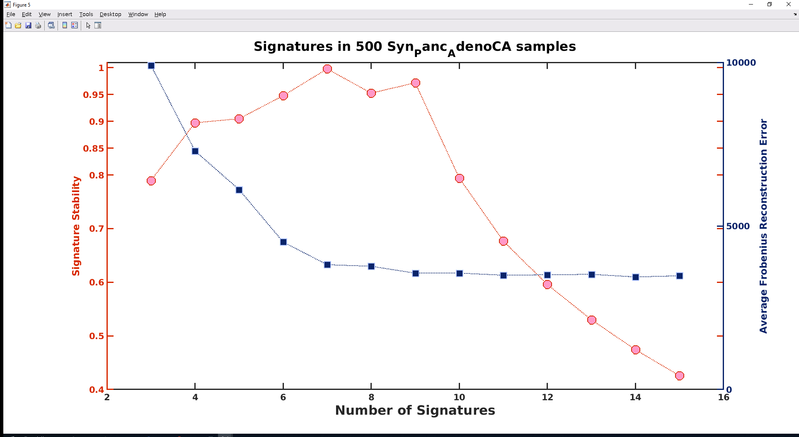

```{r setup, include = FALSE}
knitr::opts_chunk$set(
  collapse = TRUE,
  comment = "#>"
)
```

To evaluate / assess how well extracted signatures
reflect the ground-truth signatures that went into the 
synthetic data, do the following steps.  We take as the first
example SigProfiler output run on synthetic data based on
SigProfiler 96-channel mutational signature profiles and
SigProfiler attributions (exposures).


## SigProfiler example

We start by reading in the ground truth signature profiles,
the ground truth synthetic exposures, and the 
signature profiles extracted by SigProfiler.

We start with data in files because we assume
that signature extraction software is not integrated into
R.

We need the ICAMS package for reading signature profiles.

```{r readSPprofiles}
library(ICAMS)
library(SynSig)

# The column heading for signatures are different in
# SigProfiler output than in PCAWG7, so we turn of
# strict checking.
tmp.read.96 <- function(x) ReadCat96(x, strict = FALSE)
```

Based on this graph, I am not sure whether 7 or 9 signatures are preferable, so at this point we explore both.

```{r plotit, echo=FALSE, fig.cap="Stability versus reconstruction error", out.width = '60%'}

```


```{r}
SP.7.analysis <- 
  ReadAndAnalyzeSigs(
    extracted.sigs =
      "res_sp.sp.syn.2018.12.31.v2_signature_patterns_for_7_sigs.csv",
    ground.truth.sigs = "sigProfiler_SBS_signatures_2018_03_28.csv",
    ground.truth.exposures = "sp.syn.exposure.csv",
    read.ground.truth.sigs.fn = tmp.read.96)

```

The file sigProfiler_SBS_signatures_2018_03_28.csv was downloaded from Synapse (https://www.synapse.org/#!Synapse:syn11738319).  The file res_sp.sp.syn.2018.12.31.v2_signature_patterns_for_7_sigs.csv was
generated by running the MATLAB version of SigProfiler
around Dec. 31, 2018. The file sp.syn.exposure.csv contains
the synthetic exposures generated
along with the synthetic data. \code{ReadAndAnalyzeSigs} uses the
exposures to ensure that only signatures with exposures in the
synthetic data are compared to the extracted signatures.


```{r}
knitr::kable(
  SP.7.analysis$match1, 
  caption = 'Best matches from extracted to ground truth for K = 7',
  digits = 4
)

knitr::kable(
  SP.7.analysis$match2,
  caption = 'Best matches from ground truth to extracted for K = 7',
  digits = 4
)

```

The average cosine similarity is `r round(SP.7.analysis$avg, digits = 3)`.

### Plot the 9 input signatures

```{r, fig.width = 5}

tmp <- 
  lapply(colnames(SP.7.analysis$gt.sigs),
        function(x) {
          PlotCat96(SP.7.analysis$gt.sigs[ ,x, drop = FALSE],
                       type = "signature",
                    grid = FALSE, xlabels = FALSE, cex = 0.6,
                    upper = FALSE)
        })
```

### Plot the extracted signatures for K = 7

```{r, fig.width = 5}
tmp <- 
  lapply(colnames(SP.7.analysis$ex.sigs),
        function(x) {
          PlotCat96(SP.7.analysis$ex.sigs[ ,x, drop = FALSE],
                       type = "signature",
                    grid = FALSE, xlabels = FALSE, cex = 0.6,
                    upper = FALSE)
        })
```

## Try with 9 extracted signatures

```{r, fig.width = 5}
SP.9.analysis <- 
  ReadAndAnalyzeSigs(
    extracted.sigs =
      "res_sp.sp.syn.2018.12.31.v2_signature_patterns_for_9_sigs.csv",
    ground.truth.sigs = "sigProfiler_SBS_signatures_2018_03_28.csv",
    ground.truth.exposures = "sp.syn.exposure.csv",
    read.ground.truth.sigs.fn = tmp.read.96)

```

The file res_sp.sp.syn.2018.12.31.v2_signature_patterns_for_9_sigs.csv was
generated by running the MATLAB version of SigProfiler
around Dec. 31, 2018.

```{r}
knitr::kable(
  SP.9.analysis$match1,
  caption = 'Best matches from extracted to ground truth for K = 9',
  digits = 4
)

knitr::kable(
  SP.9.analysis$match2, 
  caption = 'Best matches from ground truth to extracted for K = 9',
  digits = 4
)

```

The average cosine similarity is `r round(SP.9.analysis$avg, digits = 4)`.

### Plot the extracted signatures for K = 9

```{r, fig.width = 5}
tmp <- 
  lapply(colnames(SP.9.analysis$ex.sigs),
        function(x) {
          PlotCat96(SP.9.analysis$ex.sigs[ ,x, drop = FALSE],
                       type = "signature",
                    grid = FALSE, xlabels = FALSE, cex = 0.6,
                    upper = FALSE)
        })

```

### Session Info

```{r}
sessionInfo()
```
